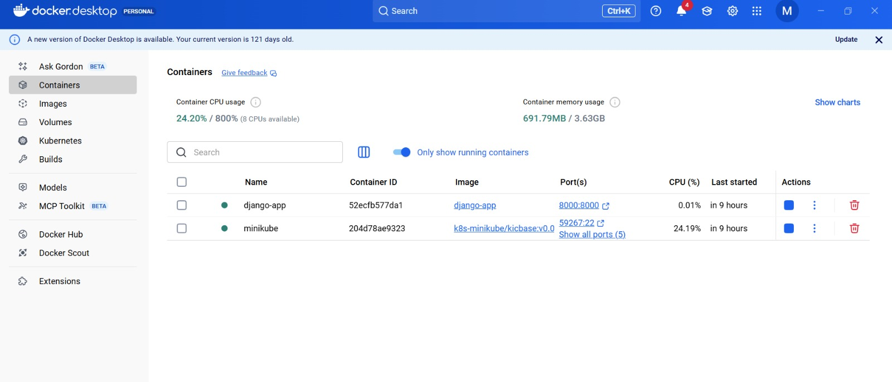
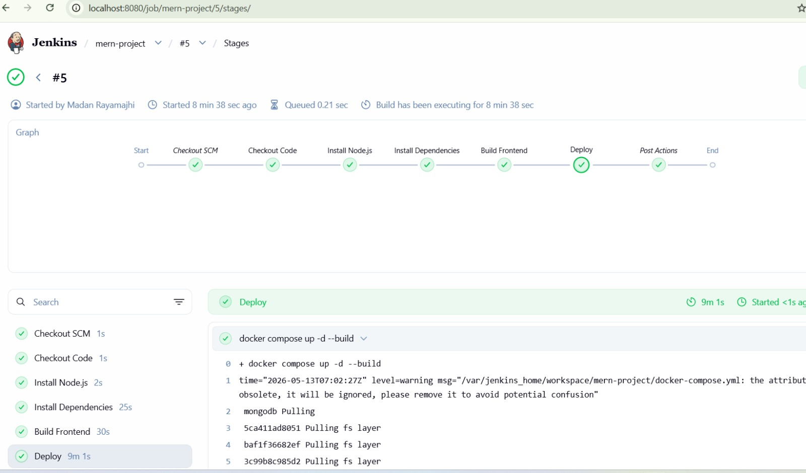
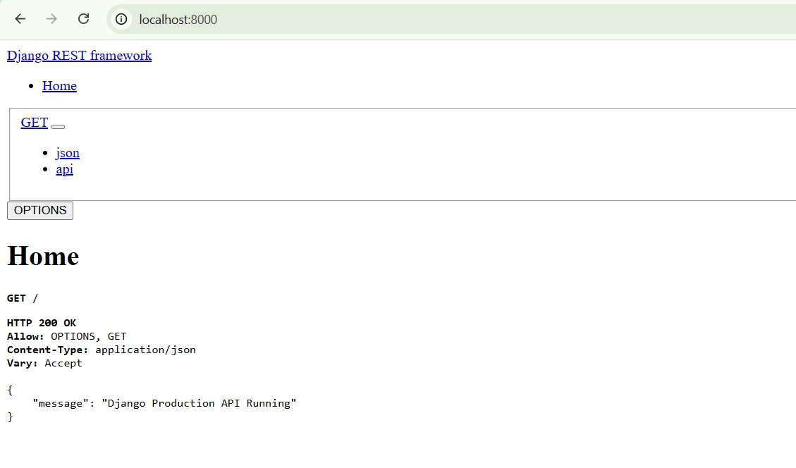

# Django DevOps Project

A production-ready Django application built with a complete DevOps workflow, including containerization, CI/CD automation, Kubernetes deployment, and infrastructure-as-code.

---

## Overview

This repository demonstrates a modern Django deployment pipeline with:
- Docker / Docker Compose for local development and container builds
- Kubernetes manifests for production deployment
- Jenkins pipeline for automated build, test, and deploy
- Terraform for infrastructure provisioning
- Nginx reverse proxy configuration

## Visual Workflow

### Container and Deployment Architecture



### Jenkins CI/CD Pipeline



### API Response Example



---

## Repository Layout

- `backend/` — Django application source, `requirements.txt`, and `Dockerfile`
- `config/` — Django project configuration, URLs, ASGI/WGI settings
- `docker-compose.yml` — local development stack with Django and PostgreSQL
- `k8s/` — Kubernetes manifests for deployment, service, ingress, and secrets
- `jenkins/` + `Jenkinsfile` — pipeline definition for CI/CD automation
- `terraform/` — infrastructure-as-code configuration for cloud provisioning
- `nginx/` — Nginx reverse proxy configuration

## Technology Stack

- Python 3.12
- Django 5.0
- Django REST Framework
- PostgreSQL 15
- Gunicorn
- Docker / Docker Compose
- Kubernetes
- Jenkins
- Terraform
- Nginx

## Prerequisites

- Git
- Docker and Docker Compose
- Kubernetes CLI (`kubectl`) and cluster access
- Jenkins for CI/CD
- Terraform
- Python 3.12

## Quick Start

1. Clone the repository:

```bash
git clone https://github.com/MadanRayamajhi/django-devops-project.git
cd django-devops-project
```

2. Start the local stack with Docker Compose:

```bash
docker-compose up --build
```

3. Open the application at `http://localhost:8000`.

### Local Django Development

```bash
python -m venv venv
source venv/bin/activate      # Windows: venv\Scripts\activate
pip install -r backend/requirements.txt
cd backend
python manage.py migrate
python manage.py runserver
```

## Testing

Run the Django test suite:

```bash
cd backend
python manage.py test
```

## Kubernetes Deployment

Apply the Kubernetes manifests:

```bash
kubectl apply -f k8s/
```

Verify the deployment:

```bash
kubectl get pods
kubectl get svc
kubectl get ingress
```

## Jenkins CI/CD

The Jenkins pipeline automates the following steps:
- checkout source code from GitHub
- build the Docker image
- run container tests and health checks
- publish build results and artifacts


## Terraform Infrastructure

Provision infrastructure from the `terraform/` directory:

```bash
cd terraform
terraform init
terraform plan
terraform apply
```

The Terraform configuration currently includes resources to support CI/CD and deployment infrastructure.

## Configuration Notes

- The Docker image is configured to run Gunicorn with `config.wsgi:application`.
- Kubernetes manifests include a ClusterIP service and ingress configuration.
- `docker-compose.yml` starts Django and PostgreSQL for local development.


